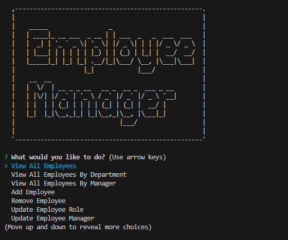

# Employee Management System

This is a simple Employee Management System implemented using Node.js and Inquirer for interactive prompts. It allows users to perform various actions related to employees, roles, and departments.

## Table of Contents
- [Installation](#installation)
- [Usage](#usage)
- [Features](#features)
- [Screenshots](#screenshots)
- [Screen Recording of Application Demo](#screen-recording-of-application-demo)
- [License](#license)

## Installation

1. Clone the repository:
   ```bash
   git clone https://github.com/wilsoncheng324/employee-management-system.git

2. Navigate to the project directory:
   ```bash
   cd employee-management-system

3. Install dependencies:
   ```bash
   npm i

4. Set up your database:
    Ensure you have a MySQL database running.
    Update the database connection details in ./db/index.js.


## Usage
1. Run the application using the following command:
    ```bash
    node index.js

2. Follow the prompts to perform various actions in the Employee Management System.

## Features

- View all employees, roles, and departments.
- Add, remove, or update employees, roles, and departments.
- View employees by department or manager.
- View the total utilized budget by department.
- Database
- The application uses a MySQL database to store employee, role, and department information. Make sure to set up your database and update the connection details in ./db/index.js.

## Screenshots



## Screen Recording of Application Demo

https://drive.google.com/file/d/1vR5wy_4UfwBkyCIlf3HZguk0nsw05WCX/view


## License

This project is licensed under the MIT License.
